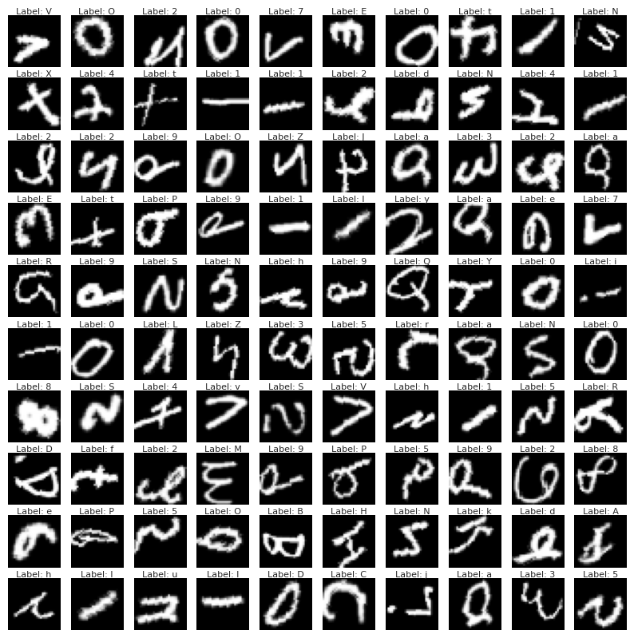
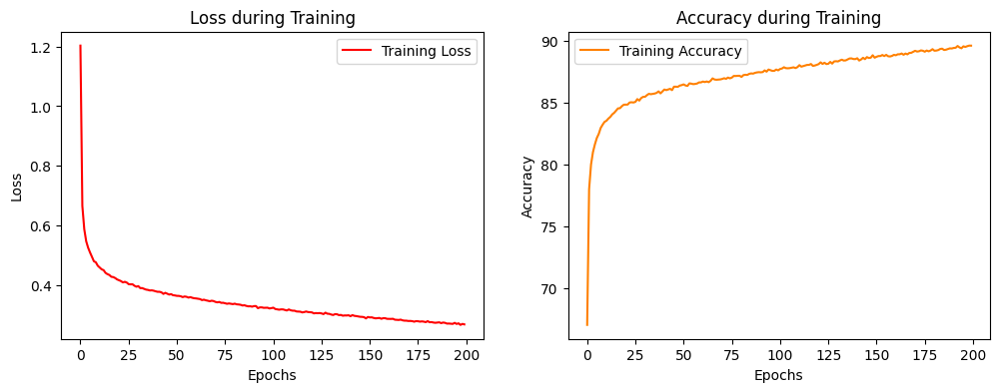
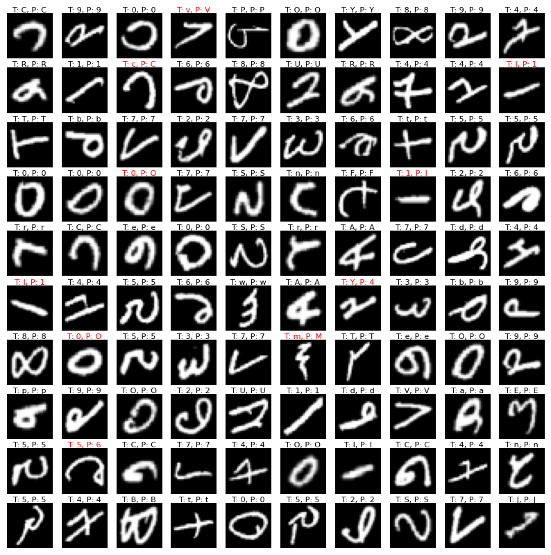
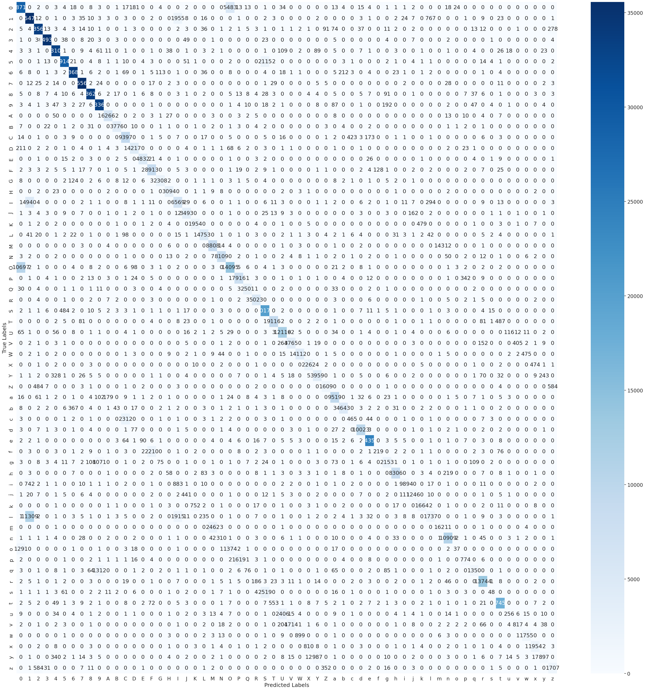
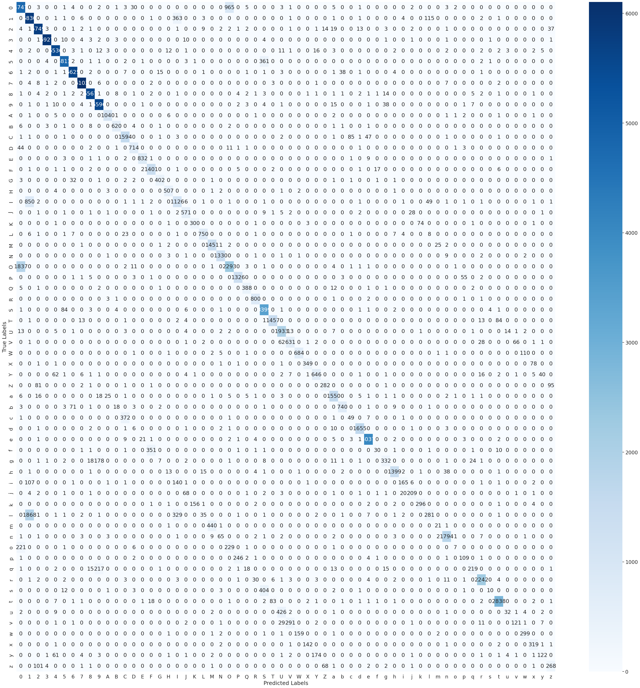

# EMNIST ByClass Handwritten Character Recognition

<p align="center">
  
</p>
<div align="center" style="font-weight: bold;">
  Convolution operation<br>
  (Source: towardsdatascience.com)
</div>


## :sparkles: 1. Introduction
### 1.1 What is the EMNIST Dataset?
The EMNIST dataset is a set of handwritten character digits derived from the NIST Special Database 19 and converted to a 28x28 pixel image format and dataset structure that directly matches the MNIST dataset. Further information on the dataset contents and conversion process can be found in the paper available at [EMNIST: an extension of MNIST to handwritten letters](https://arxiv.org/abs/1702.05373v1).

### 1.2 A short summary
There are six different splits provided in this dataset. A short summary of the dataset is provided below:      
**EMNIST ByClass: 814,255 characters. 62 unbalanced classes.**       
EMNIST ByMerge: 814,255 characters. 47 unbalanced classes.         
EMNIST Balanced: 131,600 characters. 47 balanced classes.       
EMNIST Letters: 145,600 characters. 26 balanced classes.       
EMNIST Digits: 280,000 characters. 10 balanced classes.       
EMNIST MNIST: 70,000 characters. 10 balanced classes.      
**Note: The dataset used has been bolded.**

The full complement of the NIST Special Database 19 is available in the ByClass and ByMerge splits. The EMNIST Balanced dataset contains a set of characters with an equal number of samples per class. The EMNIST Letters dataset merges a balanced set of uppercase and lowercase letters into a single 26-class task. The EMNIST Digits and EMNIST MNIST datasets provide balanced handwritten digit datasets directly compatible with the original MNIST dataset.

## :sparkles: 2. Augmentation techniques
Augmentation techniques referenced [Stochastic optimization of plain convolutional neural networks with simplemethods](https://arxiv.org/pdf/2001.08856.pdf).      
In details, they are:
```python
class AugmentDataset(Dataset):
  def __init__(self, images, labels, augment):
    self.images = images
    self.labels = labels
    # Define the data augmentation of images
    self.transform = augment

  def __len__(self):
    return len(self.images)

  def __getitem__(self, idx):
    img = self.images[idx]
    lab = self.labels[idx]
    if self.transform:
      img = self.transform(img)
    return img, lab

# A combination of five data augmentation techniques,
# including rotation, shearing, shifting up and down, zooming, and rescale
augment = transforms.Compose([
    transforms.RandomAffine(degrees=15, translate=(0.1, 0.1), scale=(0.9, 1.1), shear=3),
    transforms.ToTensor(),
    transforms.Normalize((mean, ), (std, )) # mean, std = 0.1736, 0.3248
    ])
```

<p align="center">
  
</p>
<div align="center" style="font-weight: bold;">
  Effects of augmentation techniques
</div>

## :sparkles: 3. Convolutional neural network architectures
Before choosing architectures, we referred to the [MNIST leaderboard](https://paperswithcode.com/sota/image-classification-on-mnist).        
In this experiment, six different CNNs have been reproduced and modified.
- LeNet:      
  [LeCun, Y., Bottou, L., Bengio, Y. and Haffner, P., 1998. Gradient-based learning applied to document recognition. *Proceedings of the IEEE*, 86(11), pp.2278-2324.](https://ieeexplore.ieee.org/stamp/stamp.jsp?arnumber=726791)

<p align="center">
  
</p>
<div align="center" style="font-weight: bold;">
  LeNet-5<br>
  (Source: gamedevacademy.org)
</div>

```python
# A varient of LeNet
class LeNet(nn.Module):
  def __init__(self, num_classes=62):
    super(LeNet, self).__init__()
    # Extract features
    self.features = nn.Sequential(
        nn.Conv2d(1, 6, kernel_size=5),
        nn.ReLU(inplace=True),
        nn.MaxPool2d(kernel_size=2, stride=2),
        nn.Conv2d(6, 16, kernel_size=5),
        nn.ReLU(inplace=True),
        nn.MaxPool2d(kernel_size=2, stride=2)
    )
    # Average pooling
    self.avgpool = nn.AdaptiveAvgPool2d((3, 3))
    # Feature classifier
    self.classifier = nn.Sequential(
        nn.Dropout(),
        nn.Linear(16 * 3 * 3, 120),
        nn.BatchNorm1d(120),
        nn.ReLU(inplace=True),
        nn.Dropout(),
        nn.Linear(120, 84),
        nn.BatchNorm1d(84),
        nn.ReLU(inplace=True),
        nn.Linear(84, num_classes)
    )
    self._initialize_weights()

  def forward(self, x):
    x = self.features(x)
    x = self.avgpool(x)
    x = torch.flatten(x, 1)
    x = self.classifier(x)
    return x

  # Initialise the weights
  def _initialize_weights(self):
    for m in self.modules():
      if isinstance(m, nn.Conv2d):
        # Kaiming normalisation
        init.kaiming_normal_(m.weight, mode='fan_out', nonlinearity='relu')
        if m.bias is not None:
          init.constant_(m.bias, 0)
      elif isinstance(m, nn.BatchNorm2d):
        init.constant_(m.weight, 1)
        init.constant_(m.bias, 0)
      elif isinstance(m, nn.Linear):
        init.normal_(m.weight, 0, 0.01)
        init.constant_(m.bias, 0)
```
- AlexNet:      
  [Krizhevsky, A., Sutskever, I. and Hinton, G.E., 2012. Imagenet classification with deep convolutional neural networks. *Advances in neural information processing systems*, 25.](https://proceedings.neurips.cc/paper/2012/file/c399862d3b9d6b76c8436e924a68c45b-Paper.pdf)

<p align="center">
  
</p>
<div align="center" style="font-weight: bold;">
  AlexNet<br>
  (Source: towardsdatascience.com)
</div>

```python
# A variant of AlexNet
class AlexNet(nn.Module):
  def __init__(self, num_classes=62):
    super(AlexNet, self).__init__()
    self.features = nn.Sequential(
        nn.Conv2d(1, 16, kernel_size=3, padding=2),
        nn.ReLU(inplace=True),
        nn.MaxPool2d(kernel_size=3, stride=2),
        nn.Conv2d(16, 48, kernel_size=3, padding=2),
        nn.ReLU(inplace=True),
        nn.MaxPool2d(kernel_size=3, stride=2),
        nn.Conv2d(48, 96, kernel_size=3, padding=1),
        nn.ReLU(inplace=True),
        nn.Conv2d(96, 64, kernel_size=3, padding=1),
        nn.ReLU(inplace=True),
        nn.Conv2d(64, 64, kernel_size=3, padding=1),
        nn.ReLU(inplace=True),
        nn.MaxPool2d(kernel_size=3, stride=2),
    )
    self.avgpool = nn.AdaptiveAvgPool2d((3, 3))
    self.classifier = nn.Sequential(
        nn.Dropout(),
        nn.Linear(64 * 3 * 3, 1024),
        nn.BatchNorm1d(1024),
        nn.ReLU(inplace=True),
        nn.Dropout(),
        nn.Linear(1024, 1024),
        nn.BatchNorm1d(1024),
        nn.ReLU(inplace=True),
        nn.Linear(1024, num_classes),
    )
    self._initialize_weights()

  def forward(self, x):
    x = self.features(x)
    x = self.avgpool(x)
    x = torch.flatten(x, 1)
    x = self.classifier(x)
    return x

  def _initialize_weights(self):
    for m in self.modules():
      if isinstance(m, nn.Conv2d):
        init.kaiming_normal_(m.weight, mode='fan_out', nonlinearity='relu')
        if m.bias is not None:
          init.constant_(m.bias, 0)
      elif isinstance(m, nn.BatchNorm2d):
        init.constant_(m.weight, 1)
        init.constant_(m.bias, 0)
      elif isinstance(m, nn.Linear):
        init.normal_(m.weight, 0, 0.01)
        init.constant_(m.bias, 0)
```
- VGGNet:       
  [Simonyan, K. and Zisserman, A., 2014. Very deep convolutional networks for large-scale image recognition. *arXiv preprint arXiv:1409.1556.*](https://arxiv.org/pdf/1409.1556.pdf%E3%80%82)

<p align="center">
  
</p>
<div align="center" style="font-weight: bold;">
  VGGNet-16<br>
  (Source: towardsdatascience.com)
</div>

```python
# A variant of VGGNet
class VGGNet(nn.Module):
  def __init__(self, num_classes=62):
    super(VGGNet, self).__init__()
    self.features = nn.Sequential(
      # Block 1
      nn.Conv2d(1, 16, kernel_size=3, padding=1),
      nn.ReLU(inplace=True),

      # Block 2
      nn.Conv2d(16, 32, kernel_size=3, padding=1),
      nn.ReLU(inplace=True),
      nn.MaxPool2d(kernel_size=2, stride=2),

      # Block 3
      nn.Conv2d(32, 64, kernel_size=3, padding=1),
      nn.ReLU(inplace=True),
      nn.Conv2d(64, 64, kernel_size=3, padding=1),
      nn.ReLU(inplace=True),

      # Block 4
      nn.Conv2d(64, 128, kernel_size=3, stride=1, padding=1),
      nn.ReLU(inplace=True),
      nn.Conv2d(128, 128, kernel_size=3, stride=1, padding=1),
      nn.ReLU(inplace=True),
      nn.MaxPool2d(kernel_size=2, stride=2),

      # Block 5
      nn.Conv2d(128, 128, kernel_size=3, stride=1, padding=1),
      nn.ReLU(inplace=True),
      nn.Conv2d(128, 128, kernel_size=3, stride=1, padding=1),
      nn.ReLU(inplace=True),
    )
    self.avgpool = nn.AdaptiveAvgPool2d((3, 3))
    self.classifier = nn.Sequential(
      nn.Linear(128 * 3 * 3, 512),
      nn.BatchNorm1d(512),
      nn.ReLU(inplace=True),
      nn.Dropout(),
      nn.Linear(512, 512),
      nn.BatchNorm1d(512),
      nn.ReLU(inplace=True),
      nn.Dropout(),
      nn.Linear(512, num_classes),
    )
    self._initialize_weights()

  def forward(self, x):
    x = self.features(x)
    x = self.avgpool(x)
    x = torch.flatten(x, 1)
    x = self.classifier(x)
    return x

  def _initialize_weights(self):
    for m in self.modules():
      if isinstance(m, nn.Conv2d):
        init.kaiming_normal_(m.weight, mode='fan_out', nonlinearity='relu')
        if m.bias is not None:
          init.constant_(m.bias, 0)
      elif isinstance(m, nn.BatchNorm2d):
        init.constant_(m.weight, 1)
        init.constant_(m.bias, 0)
      elif isinstance(m, nn.Linear):
        init.normal_(m.weight, 0, 0.01)
        init.constant_(m.bias, 0)
```
- ResNet:      
  [He, K., Zhang, X., Ren, S. and Sun, J., 2016. Deep residual learning for image recognition. In *Proceedings of the IEEE conference on computer vision and pattern recognition* (pp. 770-778).](https://openaccess.thecvf.com/content_cvpr_2016/papers/He_Deep_Residual_Learning_CVPR_2016_paper.pdf)

<p align="center">
  
</p>
<div align="center" style="font-weight: bold;">
  Single Residual Block<br>
  (Source: towardsdatascience.com)
</div>

```python
# A variant of ResNet
class BasicBlock(nn.Module):
  def __init__(self, in_channels, out_channels, stride=1):
    super(BasicBlock, self).__init__()
    self.conv1 = nn.Conv2d(in_channels, out_channels, kernel_size=3, stride=stride, padding=1, bias=False)
    self.bn1 = nn.BatchNorm2d(out_channels)
    self.conv2 = nn.Conv2d(out_channels, out_channels, kernel_size=3, stride=1, padding=1, bias=False)
    self.bn2 = nn.BatchNorm2d(out_channels)

    self.shortcut = nn.Sequential()
    if stride != 1 or in_channels != out_channels:
      self.shortcut = nn.Sequential(
        nn.Conv2d(in_channels, out_channels, kernel_size=1, stride=stride, bias=False),
        nn.BatchNorm2d(out_channels)
      )
  def forward(self, x):
    out = nn.ReLU(inplace=True)(self.bn1(self.conv1(x)))
    out = self.bn2(self.conv2(out))
    out += self.shortcut(x)
    out = nn.ReLU(inplace=True)(out)
    return out

class ResNet(nn.Module):
  def __init__(self, num_classes=62):
    super(ResNet, self).__init__()
    self.in_channels = 16

    self.model = nn.Sequential(
      nn.Conv2d(1, 16, kernel_size=3, stride=1, padding=1, bias=False),
      nn.BatchNorm2d(16),
      nn.ReLU(inplace=True),
      nn.MaxPool2d(kernel_size=3, stride=2, padding=1),
      self._make_layer(16, 2, stride=1),
      self._make_layer(32, 2, stride=2),
      self._make_layer(64, 2, stride=2),
      self._make_layer(128, 2, stride=2),
      nn.AdaptiveAvgPool2d((1, 1)),
      nn.Flatten(start_dim=1),
      nn.Linear(128, num_classes)
  )
    self._initialize_weights()

  def _make_layer(self, out_channels, num_blocks, stride):
    strides = [stride] + [1] * (num_blocks - 1)
    layers = []
    for stride in strides:
      layers.append(BasicBlock(self.in_channels, out_channels, stride))
      self.in_channels = out_channels
    return nn.Sequential(*layers)

  def forward(self, x):
    return self.model(x)

  def _initialize_weights(self):
    for m in self.modules():
      if isinstance(m, nn.Conv2d):
        nn.init.kaiming_normal_(m.weight, mode='fan_out', nonlinearity='relu')
        if m.bias is not None:
          nn.init.constant_(m.bias, 0)
      elif isinstance(m, nn.BatchNorm2d):
        nn.init.constant_(m.weight, 1)
        nn.init.constant_(m.bias, 0)
      elif isinstance(m, nn.Linear):
        nn.init.kaiming_normal_(m.weight, mode='fan_out', nonlinearity='relu')
        nn.init.constant_(m.bias, 0)
```
- SpinalNet:      
  [Kabir, H.D., Abdar, M., Khosravi, A., Jalali, S.M.J., Atiya, A.F., Nahavandi, S. and Srinivasan, D., 2022. Spinalnet: Deep neural network with gradual input. *IEEE Transactions on Artificial Intelligence*.](https://ieeexplore.ieee.org/stamp/stamp.jsp?arnumber=9802918)

<p align="center">
  
</p>
<div align="center" style="font-weight: bold;">
  SpinalNet Motivation<br>
  (Source: github.com/dipuk0506/SpinalNet)
</div>


```python
# A variant of SpinalNet
class SpinalNet(nn.Module):
  def __init__(self, num_classes=62):
    super(SpinalNet, self).__init__()
    self.features = nn.Sequential(
        # Block 1
        nn.Conv2d(1, 32, kernel_size=5, stride=1, padding=2),
        nn.BatchNorm2d(32),
        nn.ReLU(),
        nn.MaxPool2d(kernel_size=2, stride=2),
        # Block 2
        nn.Conv2d(32, 64, kernel_size=5, stride=1, padding=2),
        nn.BatchNorm2d(64),
        nn.ReLU(),
        nn.MaxPool2d(kernel_size=2, stride=2)
    )
    self.spinal_layer1 = nn.Linear(7 * 7 * 64 // 2, 50)
    self.spinal_layer2 = nn.Linear(7 * 7 * 64 // 2 + 50, 50)
    self.spinal_layer3 = nn.Linear(7 * 7 * 64 // 2 + 50, 50)
    self.spinal_layer4 = nn.Linear(7 * 7 * 64 // 2 + 50, 50)
    self.classifier = nn.Linear(50 * 4, num_classes)
    self._initialize_weights()
  def _initialize_weights(self):
    for m in self.modules():
      if isinstance(m, nn.Conv2d):
        nn.init.kaiming_normal_(m.weight, mode='fan_out', nonlinearity='relu')
        if m.bias is not None:
          nn.init.constant_(m.bias, 0)
      elif isinstance(m, nn.BatchNorm2d):
        nn.init.constant_(m.weight, 1)
        nn.init.constant_(m.bias, 0)
      elif isinstance(m, nn.Linear):
        nn.init.normal_(m.weight, 0, 0.01)
        nn.init.constant_(m.bias, 0)
  def forward(self, x):
    x = self.features(x)
    x = x.reshape(x.size(0), -1)
    x1 = F.dropout(F.relu(self.spinal_layer1(x[:, :7 * 7 * 64 // 2])), training=self.training)
    x2 = F.dropout(F.relu(self.spinal_layer2(torch.cat([x[:, 7 * 7 * 64 // 2:], x1], dim=1))), training=self.training)
    x3 = F.dropout(F.relu(self.spinal_layer3(torch.cat([x[:, :7 * 7 * 64 // 2], x2], dim=1))), training=self.training)
    x4 = F.dropout(F.relu(self.spinal_layer4(torch.cat([x[:, 7 * 7 * 64 // 2:], x3], dim=1))), training=self.training)
    x = torch.cat([x1, x2, x3, x4], dim=1)
    x = self.classifier(x)
    return x
```
- EnsNet:      
  [Hirata, D. and Takahashi, N., 2023. Ensemble learning in CNN augmented with fully connected subnetworks. *IEICE TRANSACTIONS on Information and Systems, 106*(7), pp.1258-1261.](https://arxiv.org/pdf/2003.08562.pdf)
```python
# A variant of EnsNet
class EnsNet(nn.Module):
  def __init__(self, num_classes=62):
      super(EnsNet, self).__init__()
      self.features = nn.Sequential(
        nn.Conv2d(1, 64, kernel_size=3, padding=1),
        nn.BatchNorm2d(64),
        nn.ReLU(inplace=True),
        nn.Dropout(0.35),
        nn.Conv2d(64, 128, kernel_size=3),
        nn.BatchNorm2d(128),
        nn.ReLU(inplace=True),
        nn.Dropout(0.35),
        nn.Conv2d(128, 256, 3, padding=1),
        nn.BatchNorm2d(256),
        nn.ReLU(inplace=True),
        nn.MaxPool2d(kernel_size=2, stride=2),
        nn.Dropout(0.35),
        nn.Conv2d(256, 512, kernel_size=3, padding=1),
        nn.BatchNorm2d(512),
        nn.ReLU(inplace=True),
        nn.Dropout(0.35),
        nn.Conv2d(512, 1024, kernel_size=3),
        nn.BatchNorm2d(1024),
        nn.ReLU(inplace=True),
        nn.Dropout(0.35),
        nn.Conv2d(1024, 2000, 3, padding=1),
        nn.BatchNorm2d(2000),
        nn.ReLU(inplace=True),
        nn.MaxPool2d(2, 2),
        nn.Dropout(0.35),
    )
      self.avgpool = nn.AdaptiveAvgPool2d((3, 3))
      self.classifier_major = nn.Linear(200 * 3 * 3, num_classes)
      self.classifiers = nn.ModuleList([
          nn.Linear(200 * 3 * 3, num_classes)
          for _ in range(10)
      ])
      self.weights = nn.Parameter(torch.ones(11) / 11, requires_grad=True)

  def forward(self, x):
    x = self.features(x)
    x = self.avgpool(x)
    x = torch.flatten(x, 1)
    x_major = self.classifier_major(x[:, :200 * 3 * 3])
    x_rest = [classifier(x[:, 200 * i * 3 * 3:200 * (i + 1) * 3 * 3]) for i, classifier in enumerate(self.classifiers)]
    all_x = torch.stack([x_major] + x_rest, dim=1)
    weighted_x = torch.sum(all_x * self.weights.view(1, -1, 1), dim=1)
    return weighted_x
```
## :sparkles: 4. Hyperparameter selection: Random Search
```python
# Define a general hyperparameter search space for most of our models, except for ResNet
param_grid = {
    'learning_rate': [1e-3, 1e-2, 1e-1], # Learning rate, one of the most important hyperparameters in machine learning and deep learning;
    'batch_size': [16, 32, 64], # Batch size, another crucial hyperparameter related to training efficiency and quality;
    'momentum': [0, 0.85, 0.9, 0.95], # Momentum, a hyperparameter of SGD, which is used to accelerate the convergence speed;
    'weight_decay': [0, 1e-2, 1e-3, 1e-4] # Weight decay, a hyperparameter for L2 regularization to avoid overfitting.
}

def train_and_evaluate(model, optimizer, criterion, train_loader, val_loader, num_epochs):
  '''Compute the validation loss during the training epochs'''
  """Parameters:
      model, corresponds to a specific classifier;
      optimizer, corresponds to a PyTorch optimizer, typically SGD and Adam;
      criterion, corresponds to Cross Entropy Loss in our context;
      train_loader, corresponds to a PyTorch DataLoader containing training inputs and labels;
      valid_loader, corresponds to a PyTorch DataLoader containing validation inputs and labels;
      num_epochs, correspond to the number of training epochs.

      Return:
      val_loss, the loss value on the validation set during the specific training procedure.
  """
  # Switch the model to the training state
  model.train()
  # Train model for several epochs
  for epoch in range(num_epochs):
    for inputs, targets in train_loader:
      optimizer.zero_grad()
      outputs = model(inputs)
      loss = criterion(outputs, targets)
      loss.backward()
      optimizer.step()

  # Switch the model to the evaluation state
  model.eval()
  # Compute the loss value on the validation set
  val_loss = 0
  with torch.no_grad():
    for inputs, targets in val_loader:
      outputs = model(inputs)
      loss = criterion(outputs, targets)
      val_loss += loss.item()

  val_loss /= len(val_loader)
  return val_loss

def random_search(model_class, param_grid, n_iter=28, num_epochs=5):
  '''Random search algorithm to find the locally optimal combination of hyperparameters.'''
  """ Parameters:
      model_class, corresponds to a specific model class, instead of an initialized model;
      param_grid, corresponds to the hyperparameter search space;
      n_iter, corresponds to the number of iterations for hyperparameter tuning, Default: 28 because it is 20% of the size of our general hyperparameter search space;
      num_epochs, corresponds to the number of training epochs, Default: 5. For hyperparameter tuning, 20 epochs are usually enough.

      Return:
      best_param, corresponds to a Python dictionary which contains the specific hyperparameter's name and its optimal option.
  """
  # Convert the hyperparameter search space from a Python dictionary to a Python list in order to sample them randomly
  param_list = list(ParameterSampler(param_grid, n_iter))
  best_loss = float('inf')
  best_params = None
  criterion = nn.CrossEntropyLoss()
  # Use a Python set to avoid repeated combinations
  params_attempt = set()

  for params in tqdm(param_list):
    params_tuple = tuple(params.items())
    if params_tuple in params_attempt:
      continue
    else:
      params_attempt.add(params_tuple)

    # Initialise a model
    model = model_class()
    # Optimizer containing 3 hyperparameters
    optimizer = optim.SGD(model.parameters(),
                          lr=params['learning_rate'], momentum=params['momentum'], weight_decay=params['weight_decay'])
    # DataLoader containing 1 hyperparameter 'batch_size' for hyperparameter tuning
    train_loader_tuning = DataLoader(emnist_mini_train, batch_size=params['batch_size'], shuffle=True, num_workers=2)
    val_loader_tuning = DataLoader(emnist_mini_val, batch_size=params['batch_size'], shuffle=True, num_workers=2)
    # Compute the validation loss value based on the function we defined before
    val_loss = train_and_evaluate(model, optimizer, criterion, train_loader_tuning, val_loader_tuning, num_epochs)

    # Compare the loss value
    if val_loss < best_loss:
      best_loss = val_loss
      best_params = params

  return best_params
```
  
## :sparkles: 5. Visualization of the training procedure
Due to the limitations of computational resources, we utilized a subset of the full dataset for training, comprising 120,000 images, which represents approximately 14% of the entire dataset.

The training procedure of VGGNet is shown below:

<p align="center">
  
</p>
<div align="center" style="font-weight: bold;">
  Training procedure of VGGNet
</div>

## :sparkles: 6. Pre-training & fine-tuning
The main difference between pre-training and fine-tuning in this experiment is:      
- Pre-training:
  - Optimizer: SGD
  - Proportion of the training data: 90%
- Fine-tuning:
  - Optimizer: Adam
  - Proportion of the training data: 100%

## :sparkles: 7. Evaluation and extension
### 7.1 Evaluation methods
```python
def evaluate(model, data_loader):
  '''Model performance, including accuracy, precision, recall, F1-score, and confusion matrix'''
  """ Parameters:
      model, corresponds to
      data_loader, corresponds to the specific PyTorch DataLoader,
      If we want to evaluate the performance of the training set, we can use the DataLoader of the training dataset;
      If we want to evaluate the performance of the test set, we can use the DataLoader of the test dataset.

      Returns:
      acc, corresponds to the accuracy of a model on the specific dataset;
      precision, corresponds to the precision of a model on the specific dataset;
      recall, corresponds to the recall of a model on the specific dataset;
      f1, corresponds to the F1 score of a model on the specific dataset;
      cm, corresponds to the confusion matrix of the specific model on the specific dataset, which is in 2D ndarray format.
  """
  # Swith the model to the evaluation state
  model.eval()
  all_preds = []
  all_labels = []
  # Compute the predicted labels
  with torch.no_grad():
    for images, labels in data_loader:
      images, labels = images.float().to(device), labels.to(device)
      outputs = model(images)
      _, predicted = torch.max(outputs.data, 1)
      all_preds.extend(predicted.cpu().numpy())
      all_labels.extend(labels.cpu().numpy())
  # Convert the data type from PyTorch Tensor to NumPy ndarray
  all_preds = np.array(all_preds)
  all_labels = np.array(all_labels)
  # Compute different metrics
  acc = accuracy_score(all_labels, all_preds)
  precision = precision_score(all_labels, all_preds, average='weighted') # Consider unbalanced classes
  recall = recall_score(all_labels, all_preds, average='weighted') # Consider unbalanced classes
  f1 = f1_score(all_labels, all_preds, average='weighted') # Consider unbalanced classes
  cm = confusion_matrix(all_labels, all_preds)
  # Swith the model back to the training state if we want to keep training
  model.train()
  return acc, precision, recall, f1, cm

def confusion_matrix_viz(cm):
  '''Visualise the confusion matrix'''
  """ Parameter:
      cm, corresponds to a confusion matrix in 2D ndarray format.
  """
  # A label mapping
  label_map = "0123456789ABCDEFGHIJKLMNOPQRSTUVWXYZabcdefghijklmnopqrstuvwxyz"
  plt.figure(figsize=(40, 40))
  sns.set(font_scale=1.5)
  sns.heatmap(cm, annot=True, fmt='g', cmap='Blues', xticklabels=label_map, yticklabels=label_map)
  plt.xlabel('Predicted Labels')
  plt.ylabel('True Labels')
  plt.show()
```
### 7.2 Performance on the training set
<div align="center">
<table style="text-align: center;">
  <caption>Performance of different CNNs on the training set</caption>
  <tr>
    <td></td>
    <td align="center">AlexNet</td>
    <td align="center">VGGNet</td>
    <td align="center">SpinalNet</td>
    <td align="center">ResNet</td>
  </tr>
  <tr>
    <td align="center">Accuracy</td>
    <td align="center">87.95%</td>
    <td align="center">89.80%</td>
    <td align="center">87.15%</td>
    <td align="center">89.28%</td>
  </tr>
  <tr>
    <td align="center">Precision</td>
    <td align="center">87.62%</td>
    <td align="center">90.01%</td>
    <td align="center">86.18%</td>
    <td align="center">89.24%</td>
  </tr>
  <tr>
    <td align="center">Recall</td>
    <td align="center">87.95%</td>
    <td align="center">89.80%</td>
    <td align="center">87.15%</td>
    <td align="center">89.28%</td>
  </tr>
  <tr>
    <td align="center">F1 score</td>
    <td align="center">86.59%</td>
    <td align="center">88.42%</td>
    <td align="center">85.28%</td>
    <td align="center">88.30%</td>
  </tr>
</table>
</div>

<div align="center">
<table style="text-align: center;">
  <caption>Performance of different CNNs on the test set</caption>
  <tr>
    <td></td>
    <td align="center">AlexNet</td>
    <td align="center">VGGNet</td>
    <td align="center">SpinalNet</td>
    <td align="center">ResNet</td>
  </tr>
  <tr>
    <td align="center">Accuracy</td>
    <td align="center">86.96%</td>
    <td align="center">87.24%</td>
    <td align="center">85.92%</td>
    <td align="center">86.88%</td>
  </tr>
  <tr>
    <td align="center">Precision</td>
    <td align="center">85.55%</td>
    <td align="center">86.43%</td>
    <td align="center">85.92%</td>
    <td align="center">86.88%</td>
  </tr>
  <tr>
    <td align="center">Recall</td>
    <td align="center">86.96%</td>
    <td align="center">87.24%</td>
    <td align="center">85.92%</td>
    <td align="center">86.88%</td>
  </tr>
  <tr>
    <td align="center">F1 score</td>
    <td align="center">85.58%</td>
    <td align="center">85.66%</td>
    <td align="center">84.07%</td>
    <td align="center">85.68%</td>
  </tr>
</table>
</div>

### 7.3 Generalization ability
* Performance on the entire dataset: 814,255 images
<p align="center">
  
</p>
<div align="center" style="font-weight: bold;">
  Predictions on random sampling characters
</div>

<p align="center">
  
</p>
<div align="center" style="font-weight: bold;">
  Confusion matrix on the training set
</div>
<p align="center">
  
</p>
<div align="center" style="font-weight: bold;">
  Confusion matrix on the test set
</div>

* Performance on the downstream task: MNIST
<div align="center">
<table style="text-align: center;">
  <caption>Transfer learning performance of VGGNet on the MNIST datasets after 5 learning epochs</caption>
  
  <tr>
    <td></td>
    <td align="center">Training</td>
    <td align="center">Test</td>
  </tr>
  <tr>
    <td align="center">Accuracy</td>
    <td align="center">95.24%</td>
    <td align="center">95.27%</td>
  </tr>
  <tr>
    <td align="center">Precision</td>
    <td align="center">95.26%</td>
    <td align="center">95.27%</td>
  </tr>
  <tr>
    <td align="center">Recall</td>
    <td align="center">95.24%</td>
    <td align="center">95.27%</td>
  </tr>
  <tr>
    <td align="center">F1 score</td>
    <td align="center">95.24%</td>
    <td align="center">95.27%</td>
  </tr>
</table>
</div>

## :sparkles: 8. Project structure
'**notebook.ipynb**', the IPython Notebook for the original experiment.;       
'**showcase.ipynb**', an IPython Notebook used to briefly illustrate the outcomes;      
'**CusDatasets.py**', contains two customized dataset classes;      
'**models.py**', includes the reproduced variants from research papers;      
'**trainer.py**', comprises the training procedure and related items;
'**fine_tuner**', implements the fine-tuning method;      
'**evaluator.py**', provides evaluation methods for single and multiple models;      
'**predictor.py**', offers prediction and visualization capabilities.      
